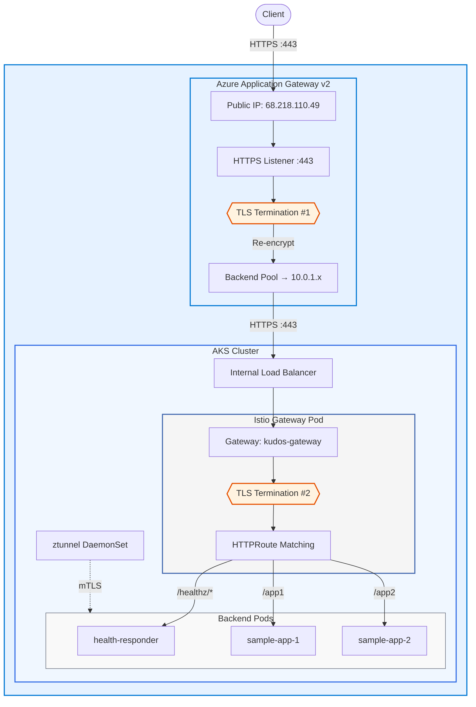
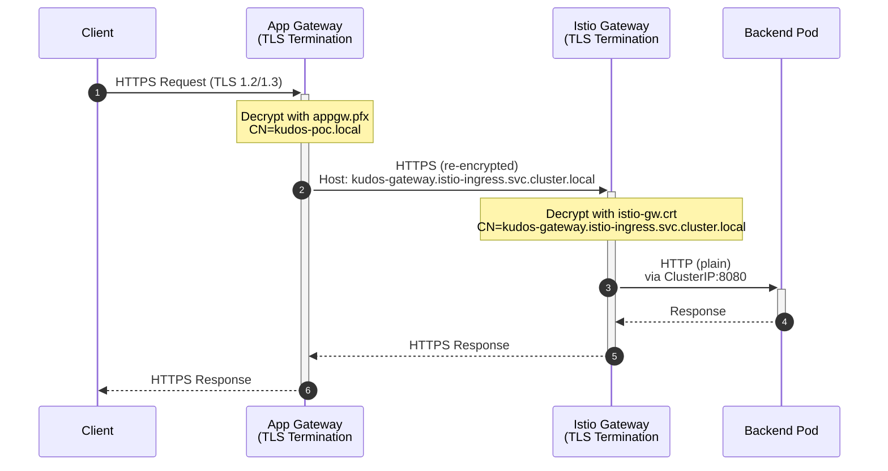
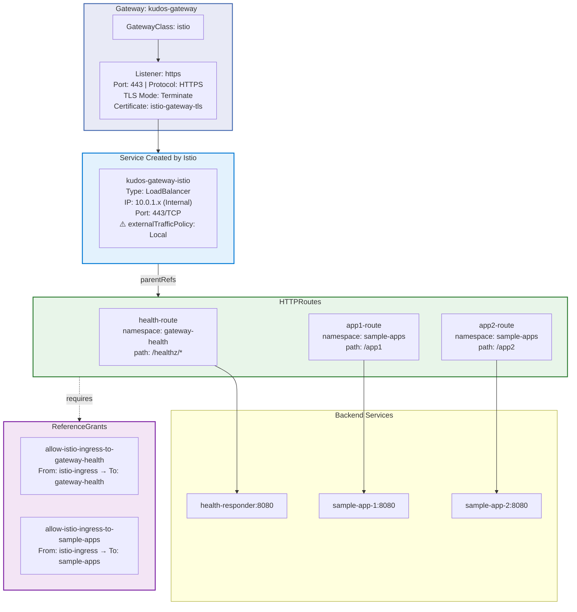
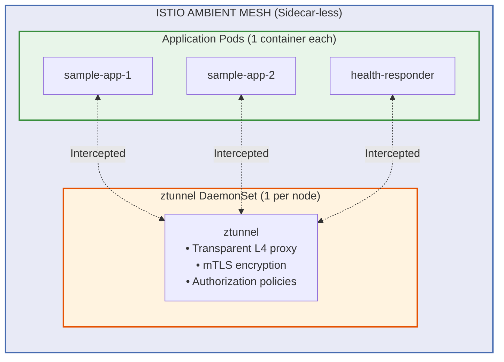
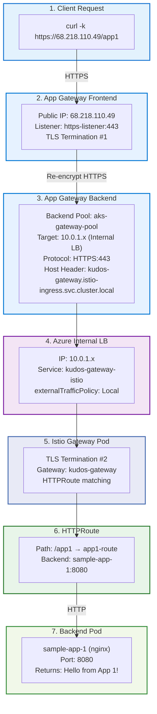
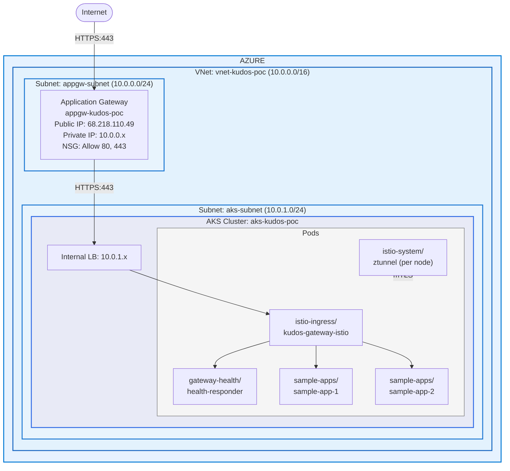
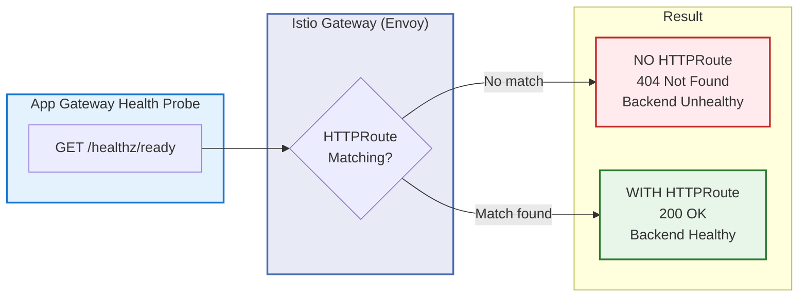
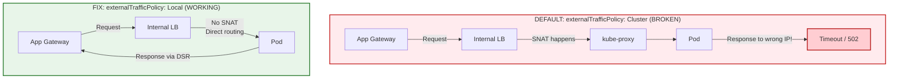

# KUDOS POC - Gateway API + Azure Application Gateway

This POC validates Azure Application Gateway integration with Kubernetes Gateway API on AKS with Istio Ambient Mesh.

## Key Technologies

- **Kubernetes Gateway API** (NOT classic Ingress)
- **Istio Ambient Mesh** (NOT sidecar mode)
- **Azure Application Gateway v2**
- **Terraform** for all Azure infrastructure
- **End-to-End TLS** with self-signed certificates

## Architecture

### High-Level Overview



### End-to-End TLS Flow (Detailed)



#### Certificate Chain

| TLS Termination | Certificate | CN | Signed By | Purpose |
|-----------------|-------------|-----|-----------|---------|
| **#1 App Gateway** | `appgw.pfx` | kudos-poc.local | KUDOS-POC-CA | Frontend HTTPS listener |
| **#2 Istio Gateway** | `istio-gw.crt` | kudos-gateway.istio-ingress.svc.cluster.local | KUDOS-POC-CA | Backend TLS from App Gateway |

#### App Gateway Backend Settings

| Setting | Value |
|---------|-------|
| Protocol | HTTPS |
| Port | 443 |
| Host Header | `kudos-gateway.istio-ingress.svc.cluster.local` |
| Trusted Root CA | `ca.crt` (KUDOS-POC-CA) |
| Health Probe | HTTPS GET `/healthz/ready` |

### Kubernetes Gateway API Components



#### Gateway Listener Configuration

| Property | Value |
|----------|-------|
| Name | `https` |
| Port | `443` |
| Protocol | `HTTPS` |
| TLS Mode | `Terminate` |
| Certificate Secret | `istio-gateway-tls` |
| Allowed Routes | All namespaces |

#### HTTPRoutes Summary

| Route | Namespace | Path | Backend Service |
|-------|-----------|------|-----------------|
| `health-route` | gateway-health | `/healthz/*` | health-responder:8080 |
| `app1-route` | sample-apps | `/app1` | sample-app-1:8080 |
| `app2-route` | sample-apps | `/app2` | sample-app-2:8080 |

### Istio Ambient Mesh Architecture



**Key Benefits:**
- No sidecar containers (1 container per pod instead of 2)
- Lower resource overhead
- Simplified deployment
- Transparent traffic interception via ztunnel

#### Namespace Configuration

| Namespace | Ambient Mesh | Label |
|-----------|--------------|-------|
| `sample-apps` | ✅ Enabled | `istio.io/dataplane-mode: ambient` |
| `gateway-health` | ✅ Enabled | `istio.io/dataplane-mode: ambient` |
| `istio-ingress` | ❌ Not enabled | Gateway pod handles its own traffic |

### Request Flow Example: GET /app1



### Network Diagram



#### Network Configuration

| Resource | CIDR / IP |
|----------|-----------|
| VNet | `10.0.0.0/16` |
| App Gateway Subnet | `10.0.0.0/24` |
| AKS Subnet | `10.0.1.0/24` |
| Internal Load Balancer | `10.0.1.x` |
| App Gateway Public IP | `68.218.110.49` |

## Quick Start

### Prerequisites

- Azure CLI (`az`) logged in
- Terraform >= 1.5.0
- kubectl
- istioctl (will be installed if missing)
- openssl (for TLS certificate generation)

### Deploy

```bash
# 1. Deploy Azure infrastructure (generates TLS certificates)
./scripts/01-deploy-terraform.sh

# 2. Install Istio Ambient Mesh
./scripts/02-install-istio-ambient.sh

# 3. Deploy Kubernetes resources
./scripts/03-deploy-kubernetes.sh

# 4. Update App Gateway backend
./scripts/04-update-appgw-backend.sh

# 5. Run validation tests
./tests/validate-poc.sh
```

### Cleanup

```bash
./scripts/99-cleanup.sh
```

## Success Criteria

| ID | Criteria | Validation |
|----|----------|------------|
| SC-1 | App Gateway health probes succeed | Backend Health = "Healthy" |
| SC-2 | `/healthz/ready` returns HTTP 200 | `curl -k https://<IP>/healthz/ready` |
| SC-3 | `/app1` routes to Sample App 1 | Returns "Hello from App 1" |
| SC-4 | `/app2` routes to Sample App 2 | Returns "Hello from App 2" |
| SC-5 | Istio Ambient Mesh active | Pods have 1 container (no sidecars) |
| SC-6 | ztunnel running | `kubectl get pods -n istio-system -l app=ztunnel` |
| SC-7 | Using Gateway API | `kubectl get gateway,httproute -A` |
| SC-8 | End-to-End TLS working | `curl -k https://<IP>/app1` |

## End-to-End TLS Configuration

This POC implements **End-to-End TLS** encryption:

1. **Client → App Gateway**: HTTPS (TLS termination at App Gateway)
2. **App Gateway → Istio Gateway**: HTTPS (re-encrypted, TLS termination at Istio)
3. **Istio Gateway → Backend Pods**: HTTP (internal cluster traffic)

When running `01-deploy-terraform.sh`:
- Self-signed certificates are automatically generated
- App Gateway is configured with HTTPS listener (port 443)
- HTTP traffic is redirected to HTTPS (301)
- Backend communication uses HTTPS to Istio Gateway

### Manual Certificate Generation

```bash
# Generate certificates manually
./scripts/generate-tls-certs.sh

# Create K8s TLS secret
./scripts/create-tls-secrets.sh
```

### Certificate Details

| Certificate | Purpose | CN |
|------------|---------|-----|
| `ca.crt` | Root CA for signing | KUDOS-POC-CA |
| `appgw.pfx` | App Gateway frontend | kudos-poc.local |
| `istio-gw.crt` | Istio Gateway backend | kudos-gateway.istio-ingress.svc.cluster.local |

## Critical Configuration Fixes

> **Important:** This POC required two critical fixes for Azure Application Gateway + AKS Internal Load Balancer integration. Without these fixes, the backend will show as "Unhealthy" and requests will fail with 502 errors.

### Fix #1: HTTPRoute for /healthz (Health Probe Routing)

**Problem:** App Gateway health probes to `/healthz/ready` returned 404 because Istio Gateway (Envoy) didn't know how to route health check requests.

**Solution:** Create a dedicated HTTPRoute that routes `/healthz/*` to a health-responder service.



**Files containing this fix:**

| File | Purpose |
|------|---------|
| [kubernetes/05-httproutes.yaml](kubernetes/05-httproutes.yaml) | Defines `health-route` HTTPRoute for `/healthz/*` path |
| [kubernetes/02-health-responder.yaml](kubernetes/02-health-responder.yaml) | Deploys nginx pod that returns 200 OK for health checks |
| [kubernetes/06-reference-grants.yaml](kubernetes/06-reference-grants.yaml) | Allows cross-namespace routing from `istio-ingress` to `gateway-health` |

**HTTPRoute Configuration:**
```yaml
# From kubernetes/05-httproutes.yaml
apiVersion: gateway.networking.k8s.io/v1
kind: HTTPRoute
metadata:
  name: health-route
  namespace: gateway-health
spec:
  parentRefs:
    - name: kudos-gateway
      namespace: istio-ingress
  rules:
    - matches:
        - path:
            type: PathPrefix
            value: /healthz
      backendRefs:
        - name: health-responder
          port: 8080
```

---

### Fix #2: externalTrafficPolicy: Local (Azure DSR Fix)

> **CRITICAL for Azure ILB + App Gateway Integration:** This fix is **mandatory** when using Azure Application Gateway with an AKS Internal Load Balancer. Without it, all requests will timeout with 502 errors.

**Problem:** App Gateway backend health showed "Unhealthy" with connection timeouts, even though the Internal LB IP was correct and pods were running.

**Root Cause:** Azure App Gateway uses DSR (Direct Server Return) with Floating IP. When `externalTrafficPolicy: Cluster` (default), kube-proxy performs SNAT which changes the source IP, causing response packets to be sent to the wrong destination.

**Solution:** Set `externalTrafficPolicy: Local` on the Istio Gateway service to prevent SNAT.



**Files containing this fix:**

| File | Purpose |
|------|---------|
| [scripts/03-deploy-kubernetes.sh](scripts/03-deploy-kubernetes.sh) | Applies patch after Gateway service is created (line 61) |
| [scripts/04-update-appgw-backend.sh](scripts/04-update-appgw-backend.sh) | Verifies/reapplies if needed before updating backend pool |

**The Fix (applied in scripts):**
```bash
# From scripts/03-deploy-kubernetes.sh (line 61)
kubectl patch svc kudos-gateway-istio -n istio-ingress \
  -p '{"spec":{"externalTrafficPolicy":"Local"}}'
```

**Verification:**
```bash
# Check current policy
kubectl get svc kudos-gateway-istio -n istio-ingress \
  -o jsonpath='{.spec.externalTrafficPolicy}'
# Should output: Local
```

---

### Summary of Critical Fixes

| Fix | Problem | Solution | Key Files |
|-----|---------|----------|-----------|
| **#1 HTTPRoute** | Health probes return 404 | Route `/healthz/*` to health-responder | `05-httproutes.yaml`, `02-health-responder.yaml` |
| **#2 externalTrafficPolicy** | Connection timeouts due to SNAT | Set `externalTrafficPolicy: Local` | `03-deploy-kubernetes.sh`, `04-update-appgw-backend.sh` |

---

## Additional Configuration Notes

### Network Contributor Role

AKS needs Network Contributor role on the VNet to create Internal Load Balancers:

```hcl
# From terraform/aks.tf
resource "azurerm_role_assignment" "aks_network_contributor" {
  scope                = azurerm_virtual_network.main.id
  role_definition_name = "Network Contributor"
  principal_id         = azurerm_kubernetes_cluster.main.identity[0].principal_id
}
```

### Gateway Service Naming

Istio creates the service with suffix `-istio`:
- Gateway name: `kudos-gateway`
- Service name: `kudos-gateway-istio`

### Backend Pool Lifecycle (Terraform)

Terraform resets the backend pool on each apply. We use lifecycle ignore to prevent this:

```hcl
# From terraform/appgateway.tf
lifecycle {
  ignore_changes = [
    backend_address_pool,  # Managed by 04-update-appgw-backend.sh
  ]
}
```

## Quick Reference Commands

```bash
# Get AKS credentials
az aks get-credentials --resource-group rg-kudos-poc --name aks-kudos-poc

# Check Gateway API resources
kubectl get gateway,httproute -A

# Get Gateway Internal LB IP
kubectl get svc -n istio-ingress kudos-gateway-istio

# Check pods (should have 1 container - no sidecars)
kubectl get pods -n sample-apps -o wide

# Check ztunnel (Ambient mesh)
kubectl get pods -n istio-system -l app=ztunnel

# Check externalTrafficPolicy
kubectl get svc kudos-gateway-istio -n istio-ingress -o jsonpath='{.spec.externalTrafficPolicy}'

# Test endpoints (replace <IP> with App Gateway public IP)
# Use -k flag for self-signed certificates
curl -k https://<IP>/healthz/ready
curl -k https://<IP>/app1
curl -k https://<IP>/app2

# Check App Gateway backend health
az network application-gateway show-backend-health \
  --resource-group rg-kudos-poc \
  --name appgw-kudos-poc

# Check TLS secret
kubectl get secret istio-gateway-tls -n istio-ingress
```

## Troubleshooting

| Issue | Check | Fix |
|-------|-------|-----|
| Gateway no IP | `kubectl describe gateway kudos-gateway -n istio-ingress` | Check AKS Network Contributor role |
| Backend unhealthy | Check HTTPRoute for /healthz | Verify health-responder running |
| 502 errors | Check Gateway logs | Verify HTTPRoutes attached |
| Sidecars present | Namespace labels | Add `istio.io/dataplane-mode: ambient` |
| ztunnel not running | Istio install | Reinstall with `--set profile=ambient` |
| HTTPS 502 | Certificate hostname mismatch | Check backend settings hostname |
| Backend timeout | externalTrafficPolicy | Patch service to `Local` |
| LoadBalancer pending | Network Contributor role | Add role to AKS identity |

### Common HTTPS Issues

1. **Certificate hostname mismatch**: Backend settings must use `host_name = "kudos-gateway.istio-ingress.svc.cluster.local"`

2. **Trusted root certificate**: App Gateway needs the CA certificate that signed the backend cert

3. **TLS secret not found**: Run `./scripts/create-tls-secrets.sh` or check namespace

## Access URLs

After successful deployment (use `-k` flag with curl for self-signed certificates):

| Endpoint | URL |
|----------|-----|
| Health Check | `https://<IP>/healthz/ready` |
| App 1 | `https://<IP>/app1` |
| App 2 | `https://<IP>/app2` |

Get the IP from Terraform output:
```bash
cd terraform && terraform output appgw_public_ip
```

**Note:** HTTP requests to port 80 are automatically redirected to HTTPS (301).

---

## Author

**Shanaka Jayasundera**
Email: shanakaj@gmail.com
